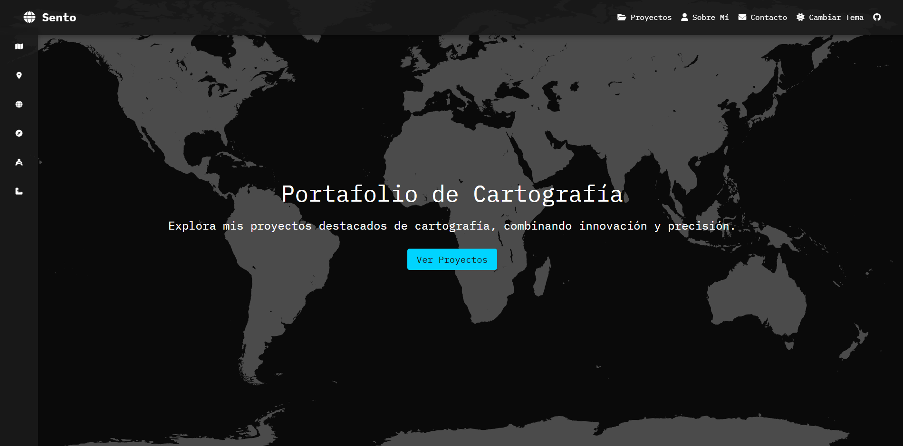
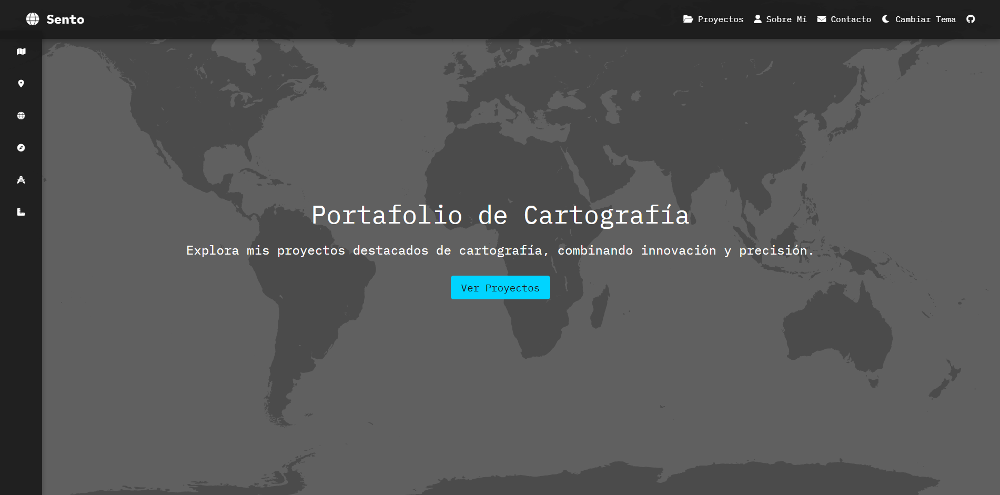

# README del Proyecto: Portafolio de Cartografía
## Descripción
Este proyecto es un **portafolio interactivo de cartografía** que presenta una colección de proyectos destacados, combinando diseño visual atractivo, interactividad y funcionalidad. Incluye un selector de tema (oscuro/claro), animaciones fluidas y una experiencia visual moderna e inmersiva. Está diseñado para resaltar la creatividad, precisión e innovación en la cartografía.
## Funcionalidades
- **Cambio de Tema Oscuro/Claro**: Alterna entre modos oscuro y claro con un sistema de transición suave.
- **Galería de Proyectos**: Presentación destacada de los proyectos en una vista interactiva, con una superposición visual que permite ampliar las imágenes al hacer clic.
- **Animaciones en los Elementos**: Animaciones responsive y elegantes utilizando la biblioteca `AOS` para efectos de entrada.
- **Diseño Responsivo**: Totalmente optimizado para dispositivos de diferentes tamaños de pantalla, desde escritorio hasta móviles.
- **Menú de Navegación Fija**: Encabezado y barra lateral de navegación con enlaces a las diferentes secciones del sitio, accesibles en cualquier momento.
- **Optimización de Visualización**: Diseño minimalista con fuentes modernas gracias a la integración de Google Fonts.

## Tecnologías Utilizadas
- **HTML5**: Estructura semántica sólida.
- **CSS3**:
    - Diseño responsivo.
    - Animaciones y transiciones modernas.

- **JavaScript (ES6)**:
    - Funcionalidad del cambio de tema.
    - Superposición para el contenido visual interactivo.
    - Uso de bibliotecas externas para características avanzadas.

- **Bootstrap 5.3.3**: Sistema de rejilla y componentes estilizados.
- **Bibliotecas Externas**:
    - [AOS.js](): Para animaciones de desplazamiento en la página.
    - [FontAwesome](): Iconos visualmente atractivos.

- **Fuentes Modernas**: [IBM Plex Mono]().

## Estructura del Proyecto
``` 
.
├── index.html                # Archivo principal del portafolio
├── css/
│   └── styles.css            # Estilos personalizados
├── js/
│   ├── themeswitch.js        # Lógica de cambio de tema
│   └── indexAnimations.js    # Funcionalidad para animaciones y overlay
├── assets/
│   └── (imágenes y recursos utilizados)
└── README.md                 # Documento de información del proyecto
```
## Instalación y Uso
1. **Clona el repositorio o descarga el proyecto**:
``` bash
   git clone https://github.com/usuario/proyecto-cartografia.git
```
1. **Configuración del entorno**: Asegúrate de que tienes habilitado un servidor local o simplemente abre el archivo `index.html` en un navegador.
2. **Dependencias**:
    - Utiliza un gestor de paquetes como `npm` para instalar dependencias adicionales si deseas personalizar:
``` bash
     npm install
```
1. **Ejecutar**: Navega al archivo `index.html` y ábrelo en tu navegador para visualizar el portafolio y su funcionalidad.

## Créditos
- **Autor**: Sento Marcos Ibarra
- **Agradecimientos**:
    - [Bootstrap]() por sus componentes responsivos.
    - [AOS]() por su simple integración de animaciones.
    - [FontAwesome]() por los iconos modernos.
    - [Unsplash]() y otras bibliotecas de imágenes gratuitas.

## Licencia
Este proyecto está bajo la [licencia MIT]().
## Capturas de Pantalla
### **Portada con Tema Oscuro**


### **Detalle de Proyectos**

